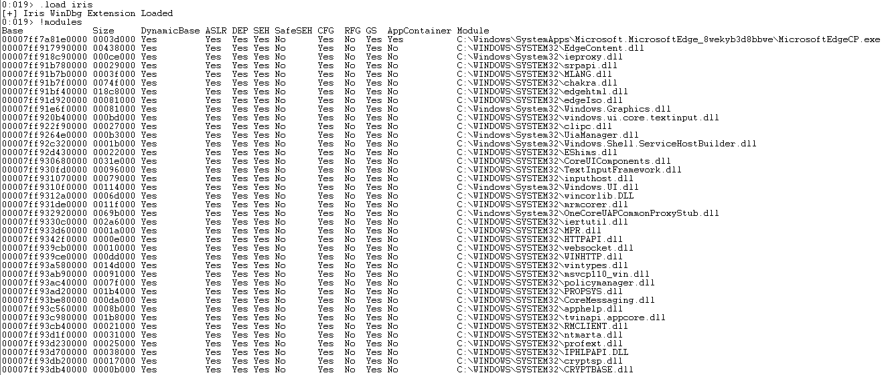

# Iris WinDbg Extension

`Iris` WinDbg extension performs basic detection of common Windows exploit mitigations (32 and 64 bits).



The checks implemented, as can be seen in the screenshot above, are (for the loaded modules):

- DynamicBase 
- ASLR 
- DEP 
- SEH 
- SafeSEH 
- CFG
- RFG
- GS
- AppContainer

If you don't know the meaning of some of the keywords above use google, you'll find better explanations than the ones I could give you.

## Setup

To "install", copy `iris.dll` into the `winext` folder for WinDbg (for `x86` and `x64`).

### WinDbg 10.0.xxxxx

Unless you installed the debug tools in a non standard path you'll find the `winext` folder at:

```
C:\Program Files (x86)\Windows Kits\10\Debuggers\x64\winext
```

Or, for 32 bits:

```
C:\Program Files (x86)\Windows Kits\10\Debuggers\x86\winext
```

### WinDbg Preview

Unless you ~installed~ copied WinDbg preview install folder into a non standard location you'll have it in a folder with a name close to the one below (depending on the installed version):

```
C:\Program Files\WindowsApps\Microsoft.WinDbg_1.1906.12001.0_neutral__9wekib2d8acwe
```

For 64 bits copy `iris.dll` into `amd64\winext` and for 32 bits copy `iris.dll` into `x86\winext`.

### Load the extension

After the steps above, just load the extension with `.load iris` and run `!iris.help` to see the available command(s).

```
0:002> .load iris
[+] Iris WinDbg Extension Loaded
0:002> !iris.help

IRIS WinDbg Extension (rui@deniable.org). Available commands:
	help                  = Shows this help
	modules               = Display exploit mitigations for all loaded modules.
```

## Running

As shown in the screenshot above, just run: `!iris.modules` or simply `!modules`.

## Warning

**Don't trust blindly on the results, some might not be accurate**. I pretty much used as reference [PE-bear parser](https://github.com/hasherezade/bearparser/), [winchecksec](https://github.com/trailofbits/winchecksec/), [Process Hacker](https://github.com/processhacker/processhacker), and [narly](https://github.com/d0c-s4vage/narly/). Thank you to all of them.

I put this together in a day to save some time during a specific assignment. It worked for me but it hasn't been throughly tested. You have been warned, use at your own risk.

I'll be updating and maintining this, so any issues you may find please let me know. I plan to add a few more mitigations later.

## References

Besides the references mentioned before, if you want to write your own extension (or contribute to this one) the [Advanced Windows Debugging](https://archive.codeplex.com/?p=awd) book and the WinDbg SDK are your friends.
